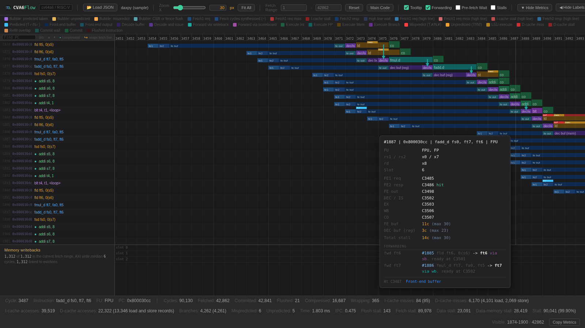

# CVA6Flow

A browser-based pipeline visualizer for the CORE-V CVA6 RISC-V core. It reconstructs the pipeline cycle by cycle from a Verilator-generated VCD, straight off the RTL, and draws every in-flight instruction as a row.



## Motivation

Simulating CVA6 in RTL provides absolute truth, but in an unreadable format. A single DAXPY run generates a ~1.29 GB VCD file where the raw signals are present, but the instruction context is lost. The waveform knows exactly when `wt_valid_i` and `commit_ack_o` toggle, but it knows nothing about the load that missed and stalled the rest of the pipeline.

CVA6Flow bridges this gap. It reconstructs the instruction-level view directly from the RTL signals, tracking every in-flight instruction through the core to visualise exactly what happened and when.

Zero guesswork. The core philosophy of this tool is uncompromising: every reported number must trace directly back to an actual RTL signal or architectural state. Early iterations relied on cycle-offset estimates and plausible proxies, but because those introduced silent errors, they were scrapped. If CVA6Flow reports a delay, the hardware proves it.

## Quick start

Build CVA6 with Verilator and run a test with VCD tracing enabled. [`run_verilator.py`](#running-a-test-run_verilatorpy) does that in one command and hands you the VCD and the disassembly listing:

```bash
python3 run_verilator.py cv64a6_imafdc_sv39_hpdcache daxpy.S
```

Then turn the VCD into a trace:

```bash
python3 CVA6Flow_tracer.py sim.vcd -o trace.json \
    --user-entry-pc 0x80003000 \
    --user-end-pc 0x8000314c \
    --disasm-list test.dump
```

Then open `CVA6Flow.html` in any browser and drag `trace.json` onto the window. There is nothing to install and nothing to serve. The viewer is a single self-contained HTML file with no dependencies.

The VCD is streamed rather than loaded, because these files grow quickly with run length and trace depth, well past what fits comfortably in memory.

## Tracer options

```bash
python3 CVA6Flow_tracer.py <vcd_path> [options]
```

| Option | Meaning |
| --- | --- |
| `vcd_path` | Path to the Verilator-generated `.vcd` |
| `-o`, `--output` | Output JSON path. Defaults to `<vcd_basename>.json` |
| `--scope-prefix` | Hierarchical prefix prepended to each whitelisted signal. Defaults to `TOP.ariane_testharness.i_ariane.i_cva6` |
| `--user-entry-pc` | Hex PC of `main`, used to find the warmup boundary. Everything committed before the first hit is marked as warmup |
| `--user-end-pc` | Hex PC of the last instruction of user code, typically the `jal ra, <exit>`. The viewer's `Main code` button uses it as the upper bound of the user-program range |
| `--disasm-list` | Path to an `objdump -dS` listing of the test ELF. Populates each record's `disasm` field by PC lookup. Records outside the listing, such as bootrom, keep `disasm=None` |
| `--stages` | Print per-stage resolution diagnostics on stderr |
| `--quiet` | Suppress the streaming progress indicator |

## Running a test: `run_verilator.py`

Getting a VCD out of CVA6 by hand means sourcing the simulation environment, picking the right `cva6.py` flags, and then digging the performance counters out of the log. `run_verilator.py` does all of it in one command, and is how every trace in [tests/](tests/) was produced.

```bash
python3 run_verilator.py <target> <test> [--lang c|asm] [--no-vcd]
```

| Argument | Meaning |
| --- | --- |
| `<target>` | CVA6 configuration to build, for example `cv64a6_imafdc_sv39_hpdcache` |
| `<test>` | The test to run: C (`.c`) or assembly (`.S`, `.s`, `.asm`). The type is detected from the extension |
| `--lang` | Force the type instead of detecting it. It selects both the overhead profile and the disassembly markers |
| `--no-vcd` | Skip the trace and report metrics only. Use it when you only want the numbers, since the VCD is the expensive part |
| `--keep-build` | Reuse the Verilated model in `work-ver` instead of rebuilding it. The model does not depend on the test, so this is the difference between a rebuild and a run when sweeping a set of tests. Only reuse across runs with the same target and the same trace setting, since both are baked into the build |

What it does, in order:

1. **Rebuilds.** Removes `/cva6/work-ver` so Verilator recompiles the core, unless `--keep-build` says to reuse it. Then sources `verif/sim/setup-env.sh` and runs `cva6.py` against `veri-testharness` with the project's linker script and the `syscalls.c` / `crt.S` runtime. Tracing is enabled through `TRACE_FAST` unless `--no-vcd` is given, and because that is a build-time define, changing it changes the model.
2. **Disassembles.** Runs `objdump -d -S -l` over the compiled `.o` into `<test>.list`, the full listing the tracer wants for `--disasm-list`, and prints only the measured region, the part between the `MAIN PROGRAM` and `END OF MAIN PROGRAM` markers, saving it as `<test>_clean.txt`.
3. **Extracts the metrics.** The test leaves its counter deltas in `s2`–`s10` (`x18`–`x26`) before exiting, and the script recovers them from the simulation log by register.
4. **Prints the table.** Cycles, instructions, I-cache and D-cache misses and accesses, branches, mispredictions plus unpredicted, elapsed microseconds and IPC. Two columns: `OFFICIAL` as measured, and `NET` with the fixed cost of the measurement code itself subtracted, so a short kernel is not swamped by its own instrumentation. The table is appended to `<test>_clean.txt` alongside the disassembly.

Outputs land under `verif/sim/out_<date>/`: the VCD and the log in `veri-testharness_sim/`, and the binary, the `.list` and the `_clean.txt` in `directed_tests/`.

The three files worth keeping are also copied into a `run_results/` folder next to the script, as `<test>.vcd`, `<test>.list` and `<test>_clean.txt`, so a run leaves everything the viewer needs in one place:

```bash
python3 CVA6Flow_tracer.py run_results/daxpy.vcd -o daxpy.json --disasm-list run_results/daxpy.list
```

The `_clean.txt` is the readable record of what was measured, disassembly and table together. With `--no-vcd` there is no trace, so only two files are copied.

The script assumes the CVA6 checkout is at `/cva6`, which is where the Docker image below puts it.

### Writing a test

[benchmarks/](benchmarks/) holds the tests used to develop CVA6Flow, and `test_template.c` and `test_template.S` are the starting points. The template configures the PMU (`mhpmevent3` through `mhpmevent8` for cache misses, cache accesses, branches and mispredictions), snapshots `mcycle`, `minstret` and the counters, leaves a `MAIN PROGRAM` / `END OF MAIN PROGRAM` region for your code, and then snapshots again and moves the deltas into `s2`–`s10`. Write inside the markers and the driver measures and disassembles exactly that region.

## Configuration and parameter sweeps

CVA6Flow targets the canonical `cv64a6_imafdc_sv39_hpdcache_wb` configuration, and it is built to survive changes to it. Structural parameters such as scoreboard depth are probed from the VCD itself rather than hard-coded, so a configuration sweep (different cache sizes and associativity, branch-predictor or return-address-stack depth, commit width, and so on) is handled without editing the tracer. Rebuild CVA6 with the new parameters, regenerate the VCD, and the same command produces a correct trace.

### Running the sweep: `run_CVA6Flow_sweep.py`

[cv64a6_imafdc_sv39_hpdcache_wb_config_pkg.sv](cv64a6_imafdc_sv39_hpdcache_wb_config_pkg.sv) is the config package the sweep was built with. It carries the seventeen configurations as a table, the baseline plus one cut per swept knob, each with the workload that exercises it, and a single `CVA6_CONFIG_SEL` that picks the active one:

```systemverilog
localparam int CFG_BASELINE = 1;  // reference (sb8, D$32K/8w, BHT128, ...) : all (reference)
localparam int CFG_BHT_64   = 4;  // BHTEntries 128 -> 64                   : bht_alias_test
localparam int CFG_SB_2     = 9;  // NrScoreboardEntries 8 -> 2             : daxpy

localparam int CVA6_CONFIG_SEL = CFG_BASELINE;
```

`run_CVA6Flow_sweep.py` replays all of it, which is how the traces in [tests/](tests/) were produced:

```bash
python3 run_CVA6Flow_sweep.py [--configs 1,4-6] [--tests-dir DIR] [--no-vcd] [--list]
```

| Option | Meaning |
| --- | --- |
| `--configs` | Which configurations to run, for example `1,4-6`. Defaults to every one in the table |
| `--tests-dir` | Where the workloads live. Defaults to `/cva6/verif/tests/custom/FaMAF` |
| `--tests` | Comma-separated workloads to run for every configuration, instead of the ones the table names |
| `--target` | Architecture target. Defaults to `cv64a6_imafdc_sv39_hpdcache_wb` |
| `--out-dir` | Where results are collected. Defaults to `CVA6Flow_sweep_results/` |
| `--config-pkg`, `--live-config-pkg` | The swept package, and the one the build reads. The defaults are this file and `/cva6/core/include/<same name>` |
| `--no-vcd` | Metrics only, no traces |
| `--list` | Print the plan and exit, touching nothing |

For each configuration it installs the package with `CVA6_CONFIG_SEL` set to that variant, then runs that configuration's workloads through [`run_verilator.py`](#running-a-test-run_verilatorpy). A configuration whose workload is `all` runs every workload the table names.

Results are moved out of `run_results/` into the out directory as `<test>.config<N>.vcd`, `<test>.config<N>.list` and `<test>_clean.config<N>.txt`, so one configuration never overwrites another and the VCD and its listing stay paired for the tracer.

Once a run is collected its leftovers are deleted: `run_results/`, and that run's VCD, log, binary, listing and `_clean.txt` in `verif/sim/out_<date>/`. A run that **fails** is the exception: nothing of its is collected or deleted, so its output survives the rest of the sweep and is still under `out_<date>/` at the end. If nothing failed, that tree goes too.

Two things worth knowing:

- **The live config package is overwritten and restored.** Selecting a configuration means writing `/cva6/core/include/cv64a6_imafdc_sv39_hpdcache_wb_config_pkg.sv`, so the script backs it up first and puts it back when the sweep ends, fails or is interrupted.
- **Only the first test of each configuration rebuilds the core.** The RTL changes between configurations, not between the tests of one, so the rest run with `--keep-build`.

Use `--list` first: it prints what each configuration would run, names the closest files for any workload that matches nothing, and calls out configurations left with nothing to run.

## How instructions are recovered

Each in-flight instruction is followed through the core's six stages:

```
fetch → decode → issue (allocates trans_id) → execute → writeback → commit
```

The `trans_id` allocated at issue is the handle that makes the rest possible. Writeback arrives on a packed `wt_valid_i` bus with one bit per port and a separate `trans_id_i` signal per port, so a writeback is matched to its instruction by looking up the trans_id of each asserting port. Commit works the same way through `commit_ack_o` and the scoreboard commit pointers.

Within each rising clock edge the order of processing is deliberate:

1. Flush detection, cascading so that a flush at execute also flushes decode and fetch
2. Commit, releasing scoreboard slots
3. Writeback
4. Issue, claiming slots
5. Decode
6. Fetch

Commit runs before issue on purpose: a slot freed this cycle can be reused the same cycle, and getting the order wrong yields a trace that looks plausible but is wrong.

The canonical configuration is `cv64a6_imafdc_sv39_hpdcache_wb`. Scoreboard depth is probed from the VCD rather than assumed, so parameter sweeps are handled without editing the tracer.

## What the viewer shows

Per instruction: fetch, decode, issue, execute, writeback and commit cycles, the allocated trans_id, whether it was flushed and why, and whether it belongs to warmup or to user code. Instruction words are masked to 16 bits when compressed, and disassembly is shown when a listing is supplied.

A few things worth calling out:

- **Forwarding arrows** from each producer to its consumer, distinguishing back-to-back writeback forwarding from values that sat in the scoreboard before issue.
- **Measurement-region filtering**, so warmup and bootrom are separated from the code you actually care about. For C programs the region is found from the `mcycle` reads, for assembly from the entry PC and the first jump to exit.
- **Miss counts that match the RTL performance counters** (mhpmevent 16 and 17), including the load, store and other split for the dcache, so the tool's numbers can be checked against the hardware's own.
- **A memory writeback track** showing each dirty line written back to memory and the eviction that caused it.
- **Stall highlighting** that tints every cycle column containing a stall, kept in step with the stall metric so the picture and the number always agree.

Plus the usual quality-of-life: fit-to-viewport zoom, PC search across the whole window, a hover panel with per-instruction detail, and collapsible panels. Every control has an in-app tooltip, so they are not repeated here.

Keys: `+` and `−` to zoom, arrows to navigate, `Home` and `End` to jump, `Esc` to close panels.

## Tested with

CVA6Flow has been tested against the CVA6 build in this organisation, [FaMAF-CVA6-Project/cva6](https://github.com/FaMAF-CVA6-Project/cva6).

If you would rather not build the core and its toolchain yourself, a ready-to-use Docker image is available with CVA6 and the simulation toolchain already set up, so you can generate VCDs straight away:

```bash
docker pull manuel313/cva6
```

Image: https://hub.docker.com/repository/docker/manuel313/cva6/general

## Requirements

- Python 3, standard library only
- Any modern browser
- Verilator and a CVA6 build, for producing VCDs

## Related

[MinorFlow](https://github.com/FaMAF-CVA6-Project/MinorFlow) is the sibling tool. It visualises gem5's MinorCPU from gem5 debug traces. CVA6Flow is deliberately built to look and behave the same way, so that a simulated pipeline and a real RTL pipeline can be put next to each other and compared cycle by cycle.

Both come out of an undergraduate thesis at FaMAF, Universidad Nacional de Córdoba, asking how closely a gem5 MinorCPU configuration can be made to match a real RISC-V core. CVA6Flow is what makes that question answerable, because it supplies the ground truth the gem5 side is measured against.

CVA6 itself is developed by the [OpenHW Group](https://github.com/openhwgroup/cva6).

## Licence

Released under the MIT Licence. See [LICENSE](LICENSE).
