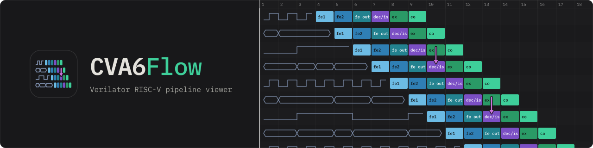

# 

A browser-based pipeline visualiser for the CORE-V CVA6 RISC-V core. It rebuilds the pipeline cycle by cycle from a Verilator VCD of the RTL, and draws every fetched instruction as a row.


## Motivation

A Verilator simulation of CVA6 records every signal, but a VCD shows signals, not instructions. A single daxpy run writes a VCD of about 1.2 GiB in which `wt_valid_i` and `commit_ack_o` toggle without saying which instruction they belong to, or that a load missed the D-cache and held back the rest of the pipeline.

CVA6Flow rebuilds the instruction-level view from those RTL signals, following each in-flight instruction through the core. What it reports falls into three kinds, and each is marked where it is produced:

- **Measured.** Fetch request and delivery cycles, the decode and issue handshake, writeback, commit, flushes, branch resolution, LSU admission and release, D-cache misses and memory writebacks. Each is read from a named RTL signal at a rising clock edge.
- **Derived.** `is_cycle` equals `dec_cycle`, because decode and issue are one handshake on this core, and `ex_cycle` is that cycle plus one, because no signal in the VCD marks entry to execute. The tracer labels both where it sets them. Fetch cycles it had to synthesise, for a wrong-path fetch killed before the I-cache answered or a line still cached from an earlier loop iteration, are listed in the record's `synthesised_stages`, counted in `metadata.stats.n_ic_records_synthesised`, and drawn with a dashed outline and a `~`.
- **Heuristic.** Binding an I-cache event to the record it fetched, attributing a bubble to its causer, `dc_coalesced`, which rests on the load unit holding one load at a time because the check path carries no source id, the one-cycle cap on a predicted-taken bubble, and the join between a memory writeback and the eviction that caused it. Each is commented where the tracer makes it.

When the VCD lacks a mechanism's signals, nothing is guessed in their place: the fields it feeds stay null or empty, and `metadata.degraded` names it, which the viewer shows as a banner and `-` figures.

## Quick start

Build CVA6 with Verilator and run a test with VCD output enabled. [`scripts/run_CVA6.py`](#running-a-test-scriptsrun_cva6py) does that in one command, and leaves the VCD and the disassembly listing in `results/run/` under the CVA6 root, which is `/CVA6/results/run/` in the Docker image:

```bash
python3 scripts/run_CVA6.py benchmarks/daxpy.S
```

Then turn the VCD into the JSON the viewer opens:

```bash
python3 CVA6Flow_tracer.py /CVA6/results/run/daxpy.vcd -o daxpy.json
```

The **objdump listing is not optional in practice**. It is where the instruction text comes from: without it every record's `disasm` is null, `metadata.disasm_list_path` is null, and the viewer refuses the JSON with that explanation. The tracer picks up `<name>.list` beside the VCD on its own, which is exactly how `scripts/run_CVA6.py` leaves them, and warns when there is none. `--disasm-list` names one anywhere else:

```bash
python3 CVA6Flow_tracer.py daxpy.vcd --disasm-list /CVA6/results/run/daxpy.list
```

Then open `CVA6Flow.html` in any browser and drag `daxpy.json` onto the window. There is nothing to install and nothing to serve. The viewer is a single self-contained HTML file with no dependencies.

### The sample JSONs

The landing page offers the sample JSONs in `tests/`. Samples are generated, not committed: `scripts/make_CVA6Flow_sample.py` trims a full tracer JSON down to one, writing `tests/<source name>.sample.js`, which the page loads, and `tests/<source name>.sample.json` beside it. A sample holds at most the page's `MAX_STREAM_INSTRUCTIONS` records, a limit the script reads from the page. It also keeps `samples.js` beside the sample, a manifest of every sample it wrote there, and warns when that is not the one in `tests/`, since the page loads only `tests/samples.js`. The page loads that one small script whether it is served or opened from disk, so it never lists a folder or parses a sample it was not asked for, and it offers only the samples its own tracer wrote at its own schema version. A sample is listed under its output's name without `.sample`, so `tests/daxpy.sample.js` is offered as `daxpy` and named `daxpy (sample)` once loaded.

```bash
python3 scripts/make_CVA6Flow_sample.py tests/daxpy.json               # -> tests/daxpy.sample.{json,js}, listed in tests/samples.js
python3 scripts/make_CVA6Flow_sample.py tests/daxpy.json -n 1500       # fewer instructions
python3 scripts/make_CVA6Flow_sample.py tests/daxpy.json --from 4000   # start past the set-up
```

## Tracer options

```bash
python3 CVA6Flow_tracer.py <vcd> [-o PATH] [--quiet] [--strict] [--scope-prefix SCOPE] [--disasm-list PATH] [--no-disasm-list] [--config-name NAME] [--emit-diagnostics] [--verbose]
```

| Option               | Meaning                                                                                                                                                                                                                                                                                                                                                                                                                                                                             |
| -------------------- | ----------------------------------------------------------------------------------------------------------------------------------------------------------------------------------------------------------------------------------------------------------------------------------------------------------------------------------------------------------------------------------------------------------------------------------------------------------------------------------- |
| `vcd`                | The Verilator VCD of a CVA6 simulation (`.vcd`)                                                                                                                                                                                                                                                                                                                                                                                                                                     |
| `-o`, `--out`        | Where to write the JSON. Defaults to the VCD path with its `.vcd` extension replaced by `.json`                                                                                                                                                                                                                                                                                                                                                                                     |
| `--quiet`            | Leave out the progress line                                                                                                                                                                                                                                                                                                                                                                                                                                                         |
| `--strict`           | Exit with 3 when `metadata.degraded` is not empty. The JSON is still written. Use it in batch runs so a degraded VCD is not mistaken for a complete one. A VCD is degraded when a mechanism's signals are missing from it, or when it was cut, holds no value changes, no rising edge, no instruction or no commit, starts part way through the run, or ends at a timestamp that disagrees with its cycle count. A cut exactly at a line boundary leaves no mark and can still pass |
| `--scope-prefix`     | The hierarchy the signal table is looked up under. Defaults to `TOP.ariane_testharness.i_ariane.i_cva6`                                                                                                                                                                                                                                                                                                                                                                             |
| `--disasm-list`      | An `objdump -d -S -l` listing of the test, which fills each record's `disasm` by PC. A record outside the listing, the bootrom for one, keeps `disasm` null. Defaults to the VCD's path with `.list` when that file exists                                                                                                                                                                                                                                                          |
| `--no-disasm-list`   | Do not look for a listing, and do not warn that there is none. The viewer refuses the JSON this produces                                                                                                                                                                                                                                                                                                                                                                            |
| `--config-name`      | The CVA6 configuration the VCD was captured on, written to `metadata.config_name` and shown in the Simulation section of the viewer's Extra Info panel. A VCD does not name its own build, so this is a label, not a measurement. Defaults to `cv64a6_imafdc_sv39_hpdcache_wb`. Neither the sweep nor `create_all_CVA6Flow_jsons.py` passes it, so name the configuration by hand when converting sweep VCDs                                                                        |
| `--emit-diagnostics` | Also write `lsu_state_history` and `dc_event_log` on every record, which no page reads. Off by default, which keeps a large JSON about 15 percent smaller                                                                                                                                                                                                                                                                                                                           |
| `--verbose`          | Print how each mechanism bound its events to the records, on stderr                                                                                                                                                                                                                                                                                                                                                                                                                 |

The VCD is streamed rather than loaded, because a VCD grows quickly with run length and with how much of the design is dumped, well past what fits comfortably in memory. Informational, warning, error and degraded lines go to stderr, and the closing summary to stdout.

`scripts/create_all_CVA6Flow_jsons.py` converts every VCD in a folder, not recursively, the tracer's folder by default, skipping every VCD whose JSON is already at least as new unless `--force` is given. It converts four at a time by default, each tracer with `--quiet` so their progress lines do not interleave, and prints one line as each VCD starts and one as it ends. `-j 1` lets the tracer's progress line through. It passes `--strict` to the tracer by default, so a degraded VCD makes the batch exit 3 while every JSON is still written, and `--no-strict` turns that off. A conversion that fails outright makes the batch exit 1 instead. `--dry-run` prints which VCDs would be converted to which JSONs and converts nothing. A VCD with no `<name>.list` beside it is skipped and named, since the viewer would refuse its JSON, and the listing is passed to the tracer with `--disasm-list`.

## Running a test: `scripts/run_CVA6.py`

Getting a VCD out of CVA6 by hand means sourcing the simulation environment, picking the right `cva6.py` flags, and then digging the performance counters out of the log. `scripts/run_CVA6.py` does all of it in one command.

```bash
python3 scripts/run_CVA6.py [target] <test> [--lang auto|c|asm] [--suite config|viewer] [--cva6-root DIR] [--no-vcd] [--keep-build] [--no-keep-sim-output]
```

| Argument               | Meaning                                                                                                                                                                                                                                                                                                |
| ---------------------- | ------------------------------------------------------------------------------------------------------------------------------------------------------------------------------------------------------------------------------------------------------------------------------------------------------ |
| `[target]`             | CVA6 configuration to build. Optional, and defaults to `cv64a6_imafdc_sv39_hpdcache_wb`, the one the overhead tables were measured on                                                                                                                                                                  |
| `<test>`               | The test to run: C (`.c`) or assembly (`.S`, `.s`, `.asm`, `.sx`). The type is detected from the extension                                                                                                                                                                                             |
| `--lang`               | Force the input type, which selects both the overhead profile and the disassembly markers. Defaults to `auto`, detection by extension                                                                                                                                                                  |
| `--no-vcd`             | Do not write the VCD, and report metrics only. Use it when you only want the numbers, since the VCD is the expensive part                                                                                                                                                                              |
| `--keep-build`         | Reuse the Verilated model in `work-ver` instead of rebuilding it. The model does not depend on the test, so this is the difference between a rebuild and a run when sweeping a set of tests. Only reuse across runs with the same target and the same VCD setting, since both are baked into the build |
| `--cva6-root`          | The CVA6 checkout to run, the one holding `verif/sim`. Defaults to `/CVA6` when it exists, otherwise the checkout this script sits in                                                                                                                                                                  |
| `--suite`              | Which overhead table to subtract, `config` or `viewer`. Defaults to the `.overhead_suite` file beside the test or up to two folders above it, and the run stops without one                                                                                                                            |
| `--no-keep-sim-output` | Leave `verif/sim/out_<date>/` in place instead of moving it to `results/verif/` at the end. The batch and the sweep pass it, since they delete the tree themselves                                                                                                                                     |

What it does, in order:

1. **Rebuilds.** Removes `work-ver` under the CVA6 root so Verilator recompiles the core, unless `--keep-build` says to reuse it. Then sources `verif/sim/setup-env.sh` and runs `cva6.py` against `veri-testharness` with the CVA6 linker script and the `syscalls.c` / `crt.S` runtime. VCD output is enabled through `TRACE_FAST` unless `--no-vcd` is given, and because that is a build-time define, changing it changes the model.
2. **Disassembles.** Runs `objdump -d -S -l` over the compiled `.o` into `<test>.list`, the full listing the tracer wants, and writes only the measured region, from the `MAIN PROGRAM` marker to `FINAL SNAPSHOT` or `END OF MAIN PROGRAM`, to `<test>_report.txt`, between a `DISASSEMBLED CODE` banner and an `END OF DISASSEMBLED CODE` one.
3. **Extracts the metrics.** The test leaves its counter deltas in `s2` to `s10` (`x18` to `x26`) before exiting, and the script recovers them from the simulation log by register.
4. **Prints the table.** Cycles, instructions, I-cache and D-cache misses and accesses, branches, mispredictions plus unpredicted, elapsed microseconds and IPC. Two columns: `OFFICIAL` as measured, and `NET` with the fixed cost of the measurement code itself subtracted, so a short kernel is not swamped by its own instrumentation. The table is appended to `<test>_report.txt` below the disassembly, in its own banner, so the two sections can be told apart at a glance. Its title line names the simulator, the program and the L1 geometry the run used, read from the target's `core/include/<target>_config_pkg.sv`, the next line names the CVA6 target, and the last the CVA6 root and the overhead table. `scripts/measure_CVA6_overhead.py` measures those tables: it runs each suite's empty `test_template` in both languages on the default target, with no VCD and one shared build, prints the profiles beside the ones `run_CVA6.py` carries, and with `--write` puts them into it.

Outputs are written under `verif/sim/out_<date>/`: the VCD and the log in `veri-testharness_sim/`, and the binary, the `.list` and the `_report.txt` in `directed_tests/`. At the end the rest of `out_<date>/` is moved to `results/verif/` under the CVA6 root, unless `--no-keep-sim-output` is given.

The three files worth keeping are gathered in `results/run/` under the CVA6 root, as `<test>.vcd`, `<test>.list` and `<test>_report.txt`, so a run leaves everything the tracer needs in one place. The VCD is moved there rather than copied, since it can run to tens of GiB and a copy would need that much disk again, and the listing and the report are copied:

```bash
python3 CVA6Flow_tracer.py /CVA6/results/run/daxpy.vcd -o daxpy.json
```

The `_report.txt` is the readable record of what was measured, disassembly and table together. With `--no-vcd` there is no VCD, so only two files are copied.

The build and the simulation are quiet: everything they write goes to `<test>_run.log` in `out_<date>/`. If the run fails nothing is moved or deleted, and the end of that log is printed.

Which CVA6 checkout it runs is `--cva6-root`: the directory holding `verif/sim`. With no value it uses `/CVA6` when that exists, which is where the Docker image below puts it, and otherwise the checkout this script sits in. It prints the root it chose on every run, and refuses with a message naming the flag when the directory it picked has no `verif/sim` in it.

### A whole folder at once

`scripts/run_all_CVA6_benchmarks.py` runs every benchmark in a folder through `run_CVA6.py`, `benchmarks/viewer` under the CVA6 root when none is given, or this repository's `benchmarks/` when the root has none, skips the templates, gathers the results in `results/batch/` in the working directory, and prints a pass and fail summary. A failed run is kept rather than cleaned, so its output is still there at the end, and an interrupted one counts as failed with code 130. Only the first test pays for the Verilator build and the rest reuse it, so a suite costs one build. `--rebuild-each` rebuilds every time, which is what a change to the RTL between tests needs.

```bash
python3 scripts/run_all_CVA6_benchmarks.py benchmarks/
```

### Writing a test

[benchmarks/](benchmarks/) holds the programs written while developing the viewer, and `test_template.c` and `test_template.S` are the starting points. The template configures the PMU (`mhpmevent3` through `mhpmevent8` for cache misses, cache accesses, branches and mispredictions), snapshots `mcycle`, `minstret` and the counters, leaves a `MAIN PROGRAM` / `END OF MAIN PROGRAM` region for your code, and then snapshots again and moves the deltas and the elapsed microseconds into `s2` to `s10`. Write inside the markers and the driver measures and disassembles exactly that region.

## Running the sweep: `scripts/run_CVA6Flow_sweep.py`

CVA6Flow targets the canonical `cv64a6_imafdc_sv39_hpdcache_wb` configuration, and it is built to survive changes to it. Structural parameters are read from the VCD rather than hard-coded: the scoreboard depth, the commit and writeback port counts, and the D-cache set count. A configuration sweep (cache sizes and associativity, branch-predictor or return-address-stack depth, commit width, and so on) is therefore handled without editing the tracer. A build with more scoreboard slots, commit ports or writeback ports than the baseline is refused with the constant to raise, and a superscalar build is refused outright.

[configs/cv64a6_imafdc_sv39_hpdcache_wb_config_CVA6Flow_pkg.sv](configs/cv64a6_imafdc_sv39_hpdcache_wb_config_CVA6Flow_pkg.sv) is the config package the sweep was built with, a modified copy of the upstream one kept beside it as `configs/cv64a6_imafdc_sv39_hpdcache_wb_config_pkg.sv`, and [configs/README.md](configs/README.md) says how the sweep installs a configuration. The swept package carries the seventeen configurations as a table, the baseline, fifteen single-knob cuts and one that cuts every knob at once, each with the workload chosen to exercise it, and a single `CVA6_CONFIG_SEL` that picks the active one:

```systemverilog
  localparam int CFG_BASELINE      = 1;   // no cut, every knob as below      : all
  localparam int CFG_BHT_64        = 4;   // BHTEntries 128 -> 64             : bht_alias_test
  localparam int CFG_SB_2          = 9;   // NrScoreboardEntries 8 -> 2       : daxpy

  localparam int CVA6_CONFIG_SEL = CFG_BASELINE;
```

`scripts/run_CVA6Flow_sweep.py` replays all of it:

```bash
python3 scripts/run_CVA6Flow_sweep.py [--configs 1,4-6] [--tests-dir DIR] [--tests LIST] [--out-dir DIR] [--target T] [--config-pkg FILE] [--live-config-pkg FILE] [--cva6-root DIR] [--suite config|viewer] [--no-vcd] [--dry-run]
```

| Option              | Meaning                                                                                                                                                                                                         |
| ------------------- | --------------------------------------------------------------------------------------------------------------------------------------------------------------------------------------------------------------- |
| `--configs`         | Which configurations to run, for example `1,4-6`. Defaults to every one in the table                                                                                                                            |
| `--tests-dir`       | Where the workloads live. Defaults to `benchmarks/viewer` under the CVA6 root, the folder the Docker image creates, or this repository's `benchmarks/` when the root has none                                   |
| `--tests`           | Comma-separated workloads to run for every configuration, instead of the ones the table names                                                                                                                   |
| `--out-dir`         | Where results are collected. Defaults to `results/sweep_CVA6Flow/` in the working directory                                                                                                                     |
| `--target`          | Architecture target. Defaults to `cv64a6_imafdc_sv39_hpdcache_wb`                                                                                                                                               |
| `--config-pkg`      | The swept package. Defaults to the first `cv64a6_imafdc_sv39_hpdcache_wb_config_CVA6Flow_pkg.sv` found next to the script, in the working directory, in `../configs/` or in `CVA6_configs/` under the CVA6 root |
| `--live-config-pkg` | The package the build reads, overwritten per configuration and restored at the end. Defaults to `core/include/cv64a6_imafdc_sv39_hpdcache_wb_config_pkg.sv` under the CVA6 root                                 |
| `--cva6-root`       | The CVA6 checkout to run and collect from, forwarded to `scripts/run_CVA6.py`. Defaults to the one `run_CVA6.py` picks                                                                                          |
| `--suite`           | Forwarded to `scripts/run_CVA6.py`: which overhead table to subtract. Defaults to the `.overhead_suite` file beside each workload, and `run_CVA6.py` stops without one                                          |
| `--no-vcd`          | Metrics only, no VCDs                                                                                                                                                                                           |
| `--dry-run`         | Print the plan and exit, touching nothing                                                                                                                                                                       |

For each configuration it installs the package with `CVA6_CONFIG_SEL` set to that variant, then runs that configuration's workloads through [`scripts/run_CVA6.py`](#running-a-test-scriptsrun_cva6py). A configuration whose workload is `all` runs every workload the table names.

Four cuts leave every counter of their workload unchanged, so their rows measure the baseline under another name, as the package notes below its table. `CFG_BTB_4`: CVA6's BTB serves only indirect jumps that are not returns, and `direct_call_return_test` has none. `CFG_DTLB_1`: daxpy runs in M-mode, which translates no address. `CFG_MAXOS_1`: only the standard and write-through D-caches read `MaxOutstandingStores`, and this target builds the HPDcache. `CFG_COMMIT_1`: the second commit port never shortens `commit_ilp_test`'s measured region.

Results are moved out of `results/run/` under the CVA6 root into the out directory as `<test>.config<N>.vcd`, `<test>.config<N>.list` and `<test>_report.config<N>.txt`, so one configuration never overwrites another and the VCD and its listing stay paired for the tracer. Every metrics table is also gathered into one file in that folder, named after the run that produced it.

Once a run is collected its leftovers are deleted: that test's files in `results/run/`, and its VCD, logs, binary, listing and `_report.txt` in every `verif/sim/out_<date>/` it wrote to, since a run that crosses midnight writes to two. Anything else in those folders is left alone. A run that **fails**, or is interrupted, which counts as a failure with code 130, is the exception: nothing of it is collected or deleted, so its output survives the rest of the sweep, and the sweep exits 1. If nothing failed, the dated folders the sweep wrote to go too.

Two things worth knowing:

- **The live config package is overwritten and restored.** Selecting a configuration means writing `core/include/cv64a6_imafdc_sv39_hpdcache_wb_config_pkg.sv` under the CVA6 root, so the script backs it up first and puts it back when the sweep ends, fails, is interrupted or is stopped with a plain `kill`. The backup is also kept on disk beside it as `<name>.sweep_backup` while the sweep runs, so a sweep killed outright, with `kill -9` or by a stopped container, leaves it behind, and the next sweep puts the package back from it before it starts.
- **Only the first test of each configuration rebuilds the core.** The RTL changes between configurations, not between the tests of one, so the rest run with `--keep-build`.

Use `--dry-run` first: it prints what each configuration would run, names the closest files for any workload that matches nothing, and calls out configurations left with nothing to run.

## How instructions are recovered

Each in-flight instruction is followed through the core's six stages:

```
fetch -> decode -> issue (allocates trans_id) -> execute -> writeback -> commit
```

Four of those six cycles are read from the VCD. **Decode, issue and execute are one measurement and two derivations**, and the tool says so rather than implying three. `issue_instr_o` is a combinational passthrough of `decoded_instr_i` (`scoreboard.sv:151`), so decode and issue are a single handshake on this core and share one observed cycle. `ex_cycle` is that cycle plus one, the cycle the issued operands reach the functional unit: no signal in the VCD marks an instruction entering execute, so it is derived rather than measured. Any comparison resting on the gap between issue and execute is reading the tool's constant, not the core.

The `trans_id` allocated at issue is the handle that makes the rest possible. Writeback arrives on a packed `wt_valid_i` bus with one bit per port and a separate `trans_id_i` signal per port, so a writeback is matched to its instruction by looking up the trans_id of each asserting port. Commit works the same way through `commit_ack_o` and the scoreboard commit pointers.

Every value is read as the VCD holds it after the rising edge, which describes the cycle that starts there: the handshakes, the decoded fields, the forwarding and the writeback bus are all read at that point, which daxpy.vcd confirms against the scoreboard entry of every issued instruction. Within each rising edge the mechanisms run in a fixed order:

1. The perf-counter samples: the I-cache and D-cache request lines, the I-cache miss pulse and the realigner
2. Commit, releasing scoreboard slots, with the scoreboard entry read again
3. Flush detection, a flush at execute also flushing the instructions still waiting to be decoded
4. Writeback, with the scoreboard entry read again
5. Decode and issue, as one combined handshake claiming a slot, with the forwarding of each operand
6. Fetch
7. The I-cache delivery timeline
8. The load and store unit FSMs
9. The D-cache miss handler's allocations, checks and refill responses
10. The memory writeback handshakes
11. Branch resolution, bound to the oldest unresolved instruction with its PC

Commit runs before the rest of the pipeline on purpose: a slot freed this cycle can be reused the same cycle, and getting the order wrong yields a JSON that looks plausible but is wrong. Decode and issue are one step rather than two because the core performs them in one handshake, as above.

## What the viewer shows

Per instruction: fetch, decode, issue, execute, writeback and commit cycles, the allocated `trans_id`, and whether it was flushed and why. Instruction words are masked to 16 bits when compressed, and the disassembly comes from the listing.

A few things worth calling out:

- **Forwarding arrows** from each producer to its consumer, ending at the consumer's issue cycle: teal for a same-cycle forward from writeback, purple for a value read from the scoreboard.
- **Measurement-region filtering**, so the harness and the bootrom are separated from the code you care about. Main Code finds the region itself: from the jump to a 4096-aligned label after the first counter read, or else from the return that follows it, up to where the harness resumes, leaving out the call into it. A program with neither runs from its first `mcycle` read to the print block after the second, so no addresses have to be supplied.
- **Miss and access counts that match the RTL performance counters** (perf events 1 and 2 for misses, 16 and 17 for accesses), counted over the current fetch range and including the load unit, store port and other split for the D-cache, so the tool's numbers can be checked against the hardware's own.
- **A memory writeback track** showing each dirty line written back to memory and the eviction that caused it.
- **Stall highlighting** that tints every cycle column containing a stall, kept in step with the stall metric so the picture and the number always agree.

When `metadata.degraded` lists a mechanism, a banner under the toolbar names it, every figure it feeds in the metric bar, Extra Info and the tooltip shows `-` instead of a number, by the same rule in MinorFlow and CVA6Flow, and Extra Info lists what each one affects.

The pre-fetch wait counts in Cycles, Time, IPC and every stall figure whatever the Pre-fetch Wait toggle says. The toggle only shows or hides the wait's cell, and no cycle number moves with it.

The viewer also has fit-to-viewport zoom, collapsible panels, a tooltip with per-instruction detail that `P` pins into a dock for side-by-side comparison, and a PC search box that matches anywhere in the address and steps through hits across the current fetch range rather than only the rows on screen. Every control has an in-app tooltip, so they are not repeated here.

Keys: `+` and `-` to zoom, arrows to navigate, `Home` and `End` to jump, `Enter` and `Shift+Enter` to step through PC matches, `P` to pin the tooltip, `Esc` to close panels and clear the pins.

## Tested with

CVA6Flow has been tested with the CVA6 build of this organisation, [FaMAF-CVA6-Project/CVA6](https://github.com/FaMAF-CVA6-Project/CVA6).

If you would rather not build the core and its toolchain yourself, a ready-to-use Docker image is available with CVA6 and the simulation toolchain already set up, so you can produce VCDs without compiling anything:

```bash
docker pull manuel313/famaf_cva6
```

Image: https://hub.docker.com/r/manuel313/famaf_cva6

## Serving it from a container: `scripts/serve_CVA6Flow.py`

A container has no browser. `scripts/serve_CVA6Flow.py` serves the page over HTTP, so it opens in the host's browser while the VCD stays inside. The page loads from the server only the samples `tests/samples.js` lists, and any other JSON from the host's disk, dropped onto it or chosen with Load JSON:

```bash
python3 scripts/serve_CVA6Flow.py              # port 8000, the page's folder
python3 scripts/serve_CVA6Flow.py --port 9000
python3 scripts/serve_CVA6Flow.py --bind 0.0.0.0
```

It serves the first of the working directory, its own folder and the folder above that holds `CVA6Flow.html`, and `--root` names another. Outside a container it listens on `127.0.0.1`, so a run on a laptop does not offer the repository to the network, and inside one on `0.0.0.0`, which a published port needs. `--bind` overrides either.

Served from this repository, the page is at `http://localhost:8000/CVA6Flow.html`. The project's image keeps the viewer in `CVA6Flow/` under its root and publishes the container's port 8000 on host port 8001, so from the host the page is at `http://localhost:8001/CVA6Flow/CVA6Flow.html`. The two viewers take different host ports, so both can be served at once.

Inside a container, `scripts/make_CVA6Flow_sample.py` turns a JSON made there into a sample in `tests/` beside the page, so the host's browser offers it without the JSON being copied out. `-n 0` keeps every record, up to the 500,000 the page renders at once.

## Requirements

- Python 3, standard library only, for the tracer and the scripts that run CVA6
- A RISC-V bare-metal toolchain, for compiling and disassembling a test: the one the CVA6 flow compiles with, and `riscv-none-elf-objdump` or `riscv64-unknown-elf-objdump`, on the path or under `$RISCV`, which `scripts/run_CVA6.py` calls
- autopep8, pycodestyle, pyflakes, Node.js and Prettier, only for the repository checks and the formatter
- Any modern browser
- Verilator and a CVA6 build, for producing VCDs

## Related

[MinorFlow](https://github.com/FaMAF-CVA6-Project/MinorFlow) is the sibling tool. It visualises gem5's MinorCPU, from gem5 debug traces. The two are deliberately built to look and behave the same way, so that a simulated pipeline and a real RTL pipeline can be put next to each other and compared cycle by cycle.

Both come out of a thesis at FaMAF, Universidad Nacional de Córdoba, asking how closely a gem5 MinorCPU configuration can be made to match a real RISC-V core. CVA6Flow is what makes that question answerable, because it supplies the ground truth the gem5 side is measured against.

CVA6 itself is developed by the [OpenHW Group](https://github.com/openhwgroup/cva6).

## Cleaning up

`scripts/clean_CVA6Flow_repo.py` deletes what a run leaves in this repository: every `.list`, `.vcd` and `.fst`, and every `__pycache__`. It lists what it found with its size and asks before deleting. No JSON or `.js` is touched, and `docs/` is kept whole.

```bash
python3 scripts/clean_CVA6Flow_repo.py [-y] [--dry-run] [-v]
```

`scripts/clean_CVA6_runs.py` is the other one, and clears run output rather than this repository's artefacts: the dated `verif/sim/out_<date>/` folders, `work-ver/`, which it asks about separately, and the `results/` subfolders the drivers write, under the CVA6 root, this repository and the working directory, plus every `__pycache__` below them. Outside the image the CVA6 root is the nearest folder above the script holding `verif/sim`, as `scripts/run_CVA6.py` finds it. It lists what it found with its size and asks before deleting. Launch it from the CVA6 root.

### Oversized JSONs

A tracer JSON is never deleted, since it is what the viewer reads, but a long run makes one too big to commit: GitHub warns above 50 MiB and refuses above 100 MiB, and git matches a path and never a size. `scripts/ignore_big_CVA6Flow_jsons.py` measures the JSONs and the sample `.js` files in this repository, leaving out the frozen `docs/old_versions/` and `docs/parser_phases/`, and writes the oversized ones into a block of `.gitignore` that it owns.

```bash
python3 scripts/ignore_big_CVA6Flow_jsons.py [-y] [--dry-run] [-v] [-l MIB] [--prune]
```

Without `--prune` it only adds, so a second run changes nothing. `--prune` drops the entries whose file has gone or shrunk below the threshold, and `-l` sets a different threshold in MiB. A file git already tracks is reported rather than ignored.

## Testing the size limits: `scripts/make_CVA6Flow_oversized.py`

Past the page's `MAX_JSON_BYTES` the viewer counts a JSON's records and streams the file, and past `MAX_STREAM_INSTRUCTIONS` it offers a range instead. A range, or a sample cut from a larger JSON, can leave out a marker of the main program, so **Main Code** is disabled unless both of its markers are among the loaded records, and its tooltip then names the records that are. `scripts/make_CVA6Flow_oversized.py` reads both from `CVA6Flow.html` and builds a JSON past both, so those paths can be exercised without waiting for a run large enough to produce one:

```bash
python3 scripts/make_CVA6Flow_oversized.py tests/daxpy.json              # a fifth past both page limits
python3 scripts/make_CVA6Flow_oversized.py tests/daxpy.json --mib 700    # by size alone
```

It repeats a tracer JSON rather than fabricating records. Without `-n` or `--mib` it goes a fifth past both of the page's limits, `-n` or `--mib` alone replaces that target, and with both, both must be reached. The closing line says which path each crossed limit sends the JSON down. The output, `oversized.json` in the working directory by default, is gitignored, and a write that fails or is interrupted removes its side files.

## Checking the repository: `scripts/check_CVA6Flow_repo.py`

Ten checks: every Python file compiles and is clean under pyflakes, every command-line script answers `--help`, the page's JavaScript parses, every shared block matches its other copies and `scripts/shared_blocks.json`, every script named in the text exists, every relative Markdown link resolves, comments carry no semicolon and no non-ASCII character but an accented letter and stay within three lines, nothing gained trailing whitespace, a missing final newline or a new over-long line, and the formatter would change nothing:

```bash
python3 scripts/check_CVA6Flow_repo.py
python3 scripts/check_CVA6Flow_repo.py --list        # name the checks and stop
python3 scripts/check_CVA6Flow_repo.py -k formatting # just one
```

A shared block is code kept identical in several files, between a `SHARED BEGIN <name>` and a `SHARED END <name>` comment. The page, the tracer and the scripts share blocks with MinorFlow and with the CVA6 fork's `viewers/FlowCompare.html` and checker. The check compares every copy in this repository with the others and with the manifest, with the copies in `MinorFlow` and `FlowCompare.html` when either sits beside this repository, and with the fork's `scripts/check_CVA6_repo.py` when this repository is the fork's submodule.

## Formatting: `scripts/format_CVA6Flow_repo.py`

autopep8 at 79 columns for the Python, Prettier for the Markdown, over this repository's own files only. autopep8 is pinned, Prettier is whatever is installed. The benchmarks get the parent repository's `.editorconfig` rules, no trailing whitespace and a final newline, and the assembly is indented by two spaces with its operands aligned one space past the file's longest mnemonic, comment lines left as they are. No C style is imposed, because none is configured for this tree. `--check` reports without changing anything, and is what the `formatter` check above runs, so a formatted tree stays formatted.

```bash
python3 scripts/format_CVA6Flow_repo.py           # format in place
python3 scripts/format_CVA6Flow_repo.py --check   # report, change nothing
python3 scripts/format_CVA6Flow_repo.py --python  # one language
```

## Licence

Released under the MIT License. See [LICENSE](LICENSE).
